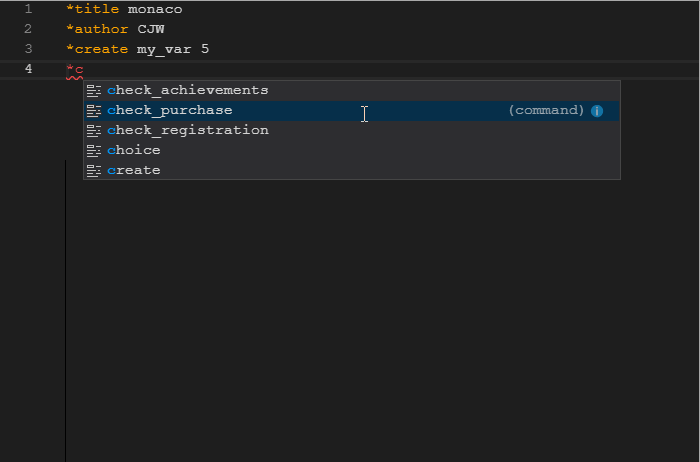
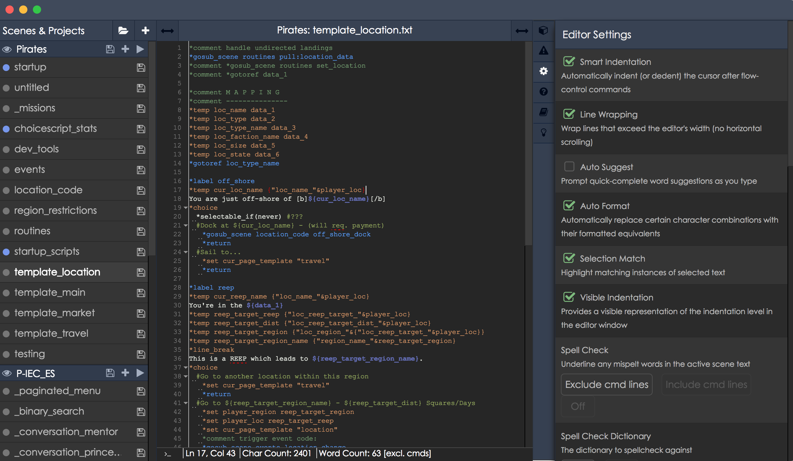
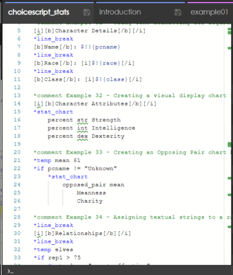

Hello everyone, and happy holidays!

I want to start this CSIDE article with a HUGE thank you! 2018 has been an absolutely phenomenal year for the ChoiceScript IDE and for ChoiceScript as well!

Over the turn of this year, CSIDE's desktop download count clocked up to—and past—the THREE THOUSAND downloads mark! 

See [https://www.somsubhra.com/github-release-stats/?username=choicescriptide&repository=main](https://www.somsubhra.com/github-release-stats/?username=choicescriptide&repository=main)

While this isn't a unique count, it's still an incredibly humbling number!

In addition, 2018 also saw: <!-- more -->

- An official mention of CSIDE by Choice of Games on their *Advanced ChoiceScript* page!
- The first anniversary of the latest iteration of CSIDE!
- A new total of 448 unique account registrations on the online/Dropbox version!

The keen eyes among you may have noticed that CSIDE's blog has been rather neglected of late. CSIDE's official release in June 2017 was not accompanied by an official blog post (despite all my intentions to write one)—a bit more than a minor blunder!

With this new year, I would like to improve on that track record, starting with this article. I'm also planning a short series to follow touching on CSIDE's future.

## The Current State of CSIDE

First off, I want to say thank you! Thank you for the immense amount of positive, constructive feedback the ChoiceScript community has given our CSIDE team. Whether you have reported a bug (or five bugs!), pointed out the feature that saved you days of agony, or suggested a new key combination, all of your feedback has been truly invaluable.

Thank you so much! And please do keep on sending us your thoughts into 2019 and beyond as we strive to improve CSIDE for all its users.

Moving forward: it's been an incredible journey from CSIDE's official release to where we are today. As I've been reviewing the comments and feedback CSIDE has received since release, I made an analysis of CSIDE's current state and its strengths and weaknesses. The analysis is below. (Please note that my points are not derived from any statistics or definitive sources, but rather my own opinions and conclusions based on users' comments and requests.)

**Things That Could Use Some Improvement:**

- **Update and Release Schedule**

  Feature releases have been few and far between, in part due to dependency on manual testing. Simple updates, such as patching the latest ChoiceScript version, should get updates into the user's hands more quickly.
- **Overall Text Editor User Experience**

  There are outstanding minor bugs and glitches related to indentation, line-wrapping, and ghost cursors. The editor also lacks certain features and implements others in awkward ways, such as the find/replace functionality and custom macros and hotkeys. Overall, the editor sometimes feels clunky and could benefit from easier customisation.
- **User Interface (UI) Space Concerns**

  The vertical scene list takes up a lot of screen area, and we're nearly out of horizontal tab room. The current UI design does not lend itself well to slider-based adjustment or multiple editor windows.

**Things That Went Well!:**

- **Simple User Experience**

  The easy and intuitive UX allows both new and experienced users of CS to make a simple download, then begin coding right away.
- **Autotests**

  CSIDE's integration of the official CS tests, Quicktest and Randomtest, provides instant automatic debugging and testing.
- **Running the Game**

  Side-by-side running of the project alongside the text editor panel makes debugging games quicker and simpler.
- **The Console**

  The Console adds interactive play testing and debugging to the CS writing experience. (There is no other direct equivalent of this feature currently available to users of CS.)
- **CS-Specific Features**

  Features such as autoindent and syntax highlighting contribute to ease of coding while helping reduce the introduction of bugs.
- **Additional Materials**

  Valuable resources include provision of tutorials, extensive help documents for CSIDE, and useful links to outside sources.

## Looking Towards 2019 

Based largely on the above analysis, there are a number of areas where we wish to focus during the upcoming year. The rest of this article touches briefly on each goal: namely, what to expect and why we think the change or addition is important. In the following months, we'll continue to follow up by reviewing the future changes in greater depth.

**Goals**

- New Editor!
- Release and Updates of Enhancements
- User Interface Improvements (Including Accessibility)
- ChoiceScript 'Standards' Discussion (to be covered at a later date)
- Modernising CSIDE
- Miscellaneous

*Please note, all of the following content (the images in particular) is speculative, consisting of approximate representations that may not be consistent with the completed features. We intend to improve these features as we implement them, particularly as we receive feedback from our readers and users relating to those features.*

### New Editor - Say Hello, Monaco

For the past few months, I've been hard at work replacing the CSIDE's current editor library with Microsoft's Monaco editor. Our primary reason (among several) in making this change is to tackle one of CSIDE's chief weaknesses: the text editor experience. We're hoping the new editor will prove more slick, much less buggy, and more feature-complete, providing a feature-rich API that will better suit our future needs and make improvements easier to implement.

Future improvements could include (but are by no means limited to):

- A code preview pane (as in Sublime).
- Context-sensitive autosuggest.
- Syntax validation—catch errors in your code before you've even run it, including:
  - Use of non-existent variables.
  - Missing parameters or options to commands.
- A command palette (in addition to the current hotkeys).
- Extensive APIs that lend themselves to potential enhancements, such as:
  - Global plus Project based find/replace.
  - An improved and extended issues tab with additional warnings, suggestions, and autofix actions.

The new editor will likely be the first major change coming this year! We'll be covering it further in one of our future articles.

**Meet the New Text Editor!**

Our new, improved text editor will include context sensitive suggestions, syntax error detection, and usage examples.

### Release and Update Enhancements

Due to the dearth of blog posts or updates, our users have been asking: What are we working on, if anything?

An excellent question. As I am the sole developer of CSIDE and I now work full time, the time I can spending developing CSIDE was drastically cut in this past year. That said, I do have a wonderful group of helpers we've dubbed the 'CSIDE Team' who assist where they can, collecting feedback, pre-testing updates, and improving and expanding the documentation. This helps me spend what little time I have on developing.

Alas, in the past, I hadn't set aside time for collating updates, writing articles, or using Twitter—which are all just as important. We hope in future to spend time improving and formalising our update process, allowing us to update CSIDE and provide blog posts predictably and periodically.

While I can't promise certain features will be released in a specific update, the CSIDE Team and I can work towards ensuring there is *some* form of periodic update—both in terms of the application and with communications from myself or the other team members.

### User Interface (and Accessibility) Improvements

We're in the process of mocking up prototypes to create a UI with more space for CSIDE's editor panel.

#### Vertical Tabs

One of our prototype UI improvements is moving our tabs in the rightmost panel to a vertical layout, since we'll very soon run out of space with the current design. A functional mock up of this is shown below (note that it is not finalised). Do please let us know your thoughts!

#### Horizontal Scene Selection

We are currently pondering a more typical horizontal layout for our Scenes & Projects list to save space and improve accessibility. An artistic (not functional, nor even slightly representative) example is below to illustrate.

What do people think? Do you prefer the current layout, or does the new one look better? We'd love to hear which you prefer and why!

### Accessibility

ChoiceScript games are an extremely accessible medium, and we want CSIDE to be fully accessible for its users too. Over the last year or so, it became apparent that we'd badly missed the mark here; there were a large number of shortcomings in our final implementation.

We've started making improvements already, including accessible notifications. The new Monaco editor also contains a number of accesibility improvements. You can read more about accessibility in Monaco by clicking

[here.]: https://github.com/Microsoft/monaco-editor/wiki/Monaco-Editor-Accessibility-Guide  "Monaco Editor Accessibility Guide"

If you use CSIDE with a screen reader or take advantage of CSIDE's other accessibility features, we'd love to hear from you! We are currently looking for additional feedback as we continue working to making CSIDE accessible and easy to use.

### Modernizing CSIDE

CSIDE started out as a simple copy-paste online ChoiceScript tester; it has transformed to what it is today through sheer passion and determination plus invaluable support from its userbase. Since CSIDE's early days, I have also grown as a programmer. ChoiceScript itself and the technology that CSIDE and CS rely on—JavaScript, web browsers, etc.—have moved on too, evolving over time.

Thus updating CSIDE's core is a primary goal as we move ahead. This may or may not result in something *visibly* different to the end user, but either way, there will be notable benefits, including:

- A more attractive and understandable codebase.
- A more stable, less bug-prone app.
- Less reinventing the wheel—the new framework will handle 'basic' functions, allowing me to spend more time on CS-related functionality.

We'll be sharing more information and seeking everyone's input as we move ahead with these plans during the upcoming year. Any changes here will lay the foundation for the next few years of CSIDE, so we're looking to our users for feedback on what would best serve you! Please feel free to let us know what you would like to see in our upcoming versions of CSIDE!

## We'll See You at the CSIDE

Thank you very much for reading and—once again—for your continued support!

Lots more details to come, so stay tuned! Please do feel free to comment with your thoughts—every tiny bit of feedback really does make our work that much easier.

Here's to a great 2019 to each and everyone one of you!

All my best,

– CJW